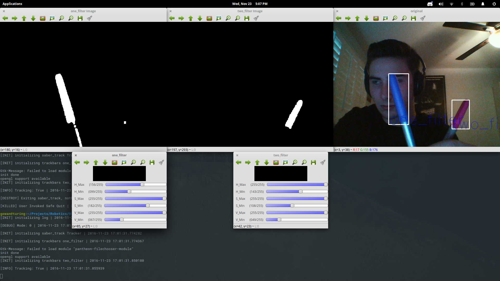

<center></center>

# Sabercat Robotics Vision Processing Utilities

## About
--------

This is the main vision repository for Saguaro High School robotics team's computer vision code. We are FRC team 4146, the Sabercats. The objective of the code is to provide tooling for designing vision systems as well as providing a fast in-game vision processing.

The current file tree is as follows: 

.<br>
├── arch_light_track.py<br>
├── log.py<br>
├── README.md<br>
├── saber_track.py<br>
├── scripts<br>
│   ├── install_cv_arch.sh<br>
│   ├── install_cv_deb.sh<br>
│   ├── install_deps.cmd<br>
│   └── install_deps.sh<br>
├── settings.json<br>
├── test.sh<br>
├── todo.md<br>
└── track.py<br>

All of the installation scripts are located in `/scripts/`
`arch_light_track.py` is a stipped down vision processing program for use on the raspberry pi.
`track.py` is the entry point of the vision tuning application.
`settings.json` can be used as settings for the application.
`saber_track.py` contains the most of the application code.
 
## Quick Example
--------------

There is only one cli argument now! This is the settings. The arguemnt defines the filename of the `.json` settings file. 

```
python track.py -s settings
```
This will load `settings.json` as the settings file.

## Settings
--------------
Here is an example of the json settings file. These are all of the current possible settings in the application.
```json
{
  "port" : "",
  "filters": "test",
  "hsv": "",
  "original": "True",
  "display": "True",
  "in_file": "",
  "out_file": "",
  "log_name": "debug_log",
  "vidmode" : "0"
}
```
- *port* is the ip address of the roborio.
- *filters* are the filter set names to track, leave spaces between words for multiple object tracking.
- *hsv* Boolean weather to have hsv window show.
- *original* Boolean weather to have original window show.
- *display* Boolean weather to have a display at all.
- *in_file* string of what to name the input file.
- *out_file* string name of output file that stores hsv color thresholds.
- *log_name* name of debug log.
- *vidmode* int camera number. 
## Filters
----------

The program uses colors to track objects. This means that it may get confused if there is a lot of 'noise' it the image. To tell the program which object it should track, we use filters. Filters are just a color reduction where we create an image from the camera stream where each pixel that falls within the color range will be white, and the pixels that are outside of the defined color range are black. We use sliders to adjust the color filters. In order to simplify the color space, we use [HSV](https://en.wikipedia.org/wiki/HSL_and_HSV). HSV is a colorspace that stands for Hue, Saturation, and Value.

Apply color thresholds with the *"filter"* value in settings.

```json
"filter": "one_filter two_filter"
```
The above setting will generate two filter thresholds to track. One called `one_filter`, the other called `two_filter`.
The following is an example of the setup application.


This generates two color filters. It makes a window and trackbar for each of the filters. As well as displays a labeled bounding box over the object.

If you have an output file in the settings, when you exit the slider positions will be saved. If you have an input file, it will take the given track positions and apply them.

### Onboard Robot Example
----------------

You'll want to adjust the color space in the enviroment you will use it in. This means you need to tweak the hsv values on game day in order to adjust for lighting and unusual noise.

For instance if you are trying to track the goal, you should go to the practice match and adjust the HSV values.


```
python arch_light_track.py test.json 192.168.1.2
```

Where `test.json` is the json output file generated and the ip is the ip of the roborio.

This will generate a track file when you **QUIT THE SESSION WITH THE Q KEY** If you didn't notice the bold caps, you need to use the q key on exit. You cannot use the keyboard disrupts that command lines have.

If you generated that file without the raspberry pi, you may transfer the file to the [scp](http://support.real-time.com/linux/web/scp.html) utility.

Use daemons to make a startup script for your raspberry pi.
## Log files

The debug log generated should be located in `debug_log.log` where log name is the json setting for ```"log_name": "debug_log",```

## Versions
------------------
*0.0.5* json settings format added, cli settings removed.
*0.0.4* Switched to json track serialization. Runs on arch now.
*0.0.3* Added tagging support. Fixed bugs. Cleaned code. Added more documentation.
*0.0.2* Added multiple filtering capabilities.
*0.0.1* Added more modes and file I/O. Cleaned code.
*0.0.0* Base opencv HSV filtering and trackbar.

### Current utilities include:
- ```log.py``` is a simple logging module for streamlined debugging and records (cv2 independent)
- ```saber_track.py``` The main module for video tracking
- ```track.py``` A small test script showing off the saber_track module

# Installation


### Install Arch on the Rapsberry Pi
Essentially, just follow this [thread](https://www.raspberrypi.org/forums/viewtopic.php?f=91&t=109545) 

When installing opencv, login to root with username: `root` and password: `root`


## Install OpenCV

### Windows

The best way to install opencv for python is to get [Anaconda](https://www.continuum.io/downloads). This is a python distribution with its own package manager that is more powerful than `pip`. This packagemanager is called `conda`. This allows you to easily install numpy on windows. [Numpy](https://anaconda.org/anaconda/numpy) for Anaconda. When Anacona is installed, make sure it works. In `cmd`, run `python`. This should open up a REPL that will prompt you with `>>>`. You should then be able to `import numpy` if this fails, you did something wrong. 
Run the `install_deps` script. `install_deps.cmd`.
Now, you should [Install](http://docs.opencv.org/3.1.0/d5/de5/tutorial_py_setup_in_windows.html#gsc.tab=0) opencv 3.0 python.

### Linux (Ubuntu based)
You can just run the install scripts. `sh insall_cv_deb.sh` You might have to play arround with the script a bit. If you find a problem, please file a pull request, or contact me.

### Rapsberry Pi (Arch)

You should be logged in as a super user. Type `su` input your password. Then run `install_cv_arch.sh` (its in the scripts folder). This should do all of the work for you. Keep in mind, it's untested. Contact me if you have any problems.

Note: If you're having a problem, It might be solved by updating your system. `pacman -Syu`

[Contact](mailto:sabercatrobotics@gmail.com)
